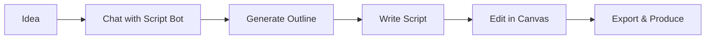

## Understanding Subscribr

Before diving into creating scripts, it's helpful to understand the core concepts that make Subscribr powerful. This guide introduces the key elements of the platform and how they work together.

## Channels

<Note>
  **Channels** are the foundation of your Subscribr workspace. Think of them as dedicated workspaces for each YouTube channel or content brand you manage.
</Note>

### What is a Channel?

A channel in Subscribr represents a content identity with its own:
- **Voice Profile**: How your AI writes for this specific channel
- **Audience Persona**: Who you're creating content for
- **Content Strategy**: Your channel's topics, style, and approach
- **Script Library**: All scripts created for this channel

### Types of Channels

<CardGroup cols={2}>
  <Card title="Linked YouTube Channel" icon="youtube">
    Connect your existing YouTube channel to:
    - Import your video library
    - Analyze your content patterns
    - Train AI on your actual voice
    - Track performance metrics
  </Card>
  <Card title="Custom Channel" icon="plus">
    Create a planning workspace to:
    - Plan new YouTube channels
    - Test content strategies
    - Build audience personas
    - Develop voice profiles
  </Card>
</CardGroup>

## Scripts & Script Bot

### Vibe Scripting Philosophy

<Info>
  **Vibe Scripting** is Subscribr's revolutionary approach where you don't fight the AI—you vibe with it. Simply chat about your idea and watch it transform into a script.
</Info>

### Script Creation Modes

<Steps>
  <Step title="Chat Mode">
    **For Ideation & Planning**
    - Natural conversation with Script Bot
    - Brainstorm ideas and approaches
    - Get strategic guidance
    - Plan content series
  </Step>
  <Step title="Canvas Mode">
    **For Writing & Editing**
    - Real-time script generation
    - Live collaborative editing
    - Instant AI revisions
    - Export-ready formatting
  </Step>
</Steps>

### Script Lifecycle

## Intelligence (Intel)

### What is Intel?

Intel is Subscribr's competitive intelligence system that helps you understand what works on YouTube before you create content.

<AccordionGroup>
  <Accordion title="Channel Intelligence" icon="tv">
    Analyze any YouTube channel to understand:
    - Content strategy and topics
    - Publishing patterns
    - Audience engagement
    - Performance trends
  </Accordion>
  <Accordion title="Video Intelligence" icon="play">
    Examine individual videos to discover:
    - Why certain videos go viral
    - Effective hooks and structures
    - Engagement patterns
    - Content gaps to fill
  </Accordion>
  <Accordion title="Outlier Detection" icon="chart-line">
    Find exceptional content by identifying:
    - Videos that exceed channel averages
    - Viral breakout moments
    - High-engagement topics
    - Untapped opportunities
  </Accordion>
</AccordionGroup>

## Voice Profiles

### Your AI Writing Partner

Voice profiles teach Subscribr's AI to write in your unique style, ensuring consistency across all content.

<Tabs>
  <Tab title="Components">
    **What makes up a voice profile:**
    - **Tone**: Casual, professional, enthusiastic
    - **Vocabulary**: Simple, technical, trendy
    - **Sentence Structure**: Short and punchy vs. flowing
    - **Personality**: Humor, authority, relatability
    - **Catchphrases**: Your signature expressions
  </Tab>
  <Tab title="Training Methods">
    **How to create voice profiles:**
    - Import existing YouTube videos
    - Provide sample scripts
    - Define rules and guidelines
    - Refine through usage
  </Tab>
  <Tab title="Application">
    **Where voice profiles apply:**
    - Script generation
    - Title creation
    - Description writing
    - Comment responses
    - Social media posts
  </Tab>
</Tabs>

## Research System

### Knowledge Management

The research system ensures your scripts are accurate, informative, and grounded in facts.

<CardGroup cols={2}>
  <Card title="Research Sidebar" icon="sidebar">
    Your content library containing:
    - Web articles
    - YouTube transcripts
    - Uploaded documents
    - AI-gathered research
  </Card>
  <Card title="AI Research Agent" icon="robot">
    Automated research that:
    - Finds relevant sources
    - Summarizes key points
    - Extracts statistics
    - Verifies facts
  </Card>
</CardGroup>

## Team Collaboration

### Working Together

Subscribr is built for teams, enabling seamless collaboration on content creation.

<Steps>
  <Step title="Shared Workspaces">
    All team members access the same:
    - Channels and settings
    - Scripts and templates
    - Research library
    - Intel discoveries
  </Step>
  <Step title="Real-Time Editing">
    Multiple people can:
    - Edit scripts simultaneously
    - See live cursor positions
    - Chat while working
    - Track changes
  </Step>
  <Step title="Role Management">
    Control who can:
    - Create new channels
    - Edit scripts
    - Access Intel
    - Manage billing
  </Step>
</Steps>

## Credits System

### Understanding Credits

Credits are the currency that powers AI operations in Subscribr.

<Info>
  **1 Credit ≈ 1 Script** - Most scripts cost between 0.8-1.2 credits depending on length and complexity.
</Info>

### Credit Usage

<Table>
  <TableHeader>
    <TableRow>
      <TableHead>Action</TableHead>
      <TableHead>Typical Credit Cost</TableHead>
    </TableRow>
  </TableHeader>
  <TableBody>
    <TableRow>
      <TableCell>Generate 10-minute script</TableCell>
      <TableCell>1.0 credits</TableCell>
    </TableRow>
    <TableRow>
      <TableCell>Intel analysis</TableCell>
      <TableCell>0.2 credits</TableCell>
    </TableRow>
    <TableRow>
      <TableCell>AI research</TableCell>
      <TableCell>0.3 credits</TableCell>
    </TableRow>
    <TableRow>
      <TableCell>Chat conversation</TableCell>
      <TableCell>0.1-0.5 credits</TableCell>
    </TableRow>
  </TableBody>
</Table>

## Platform Philosophy

### Why Subscribr Works

<CardGroup cols={3}>
  <Card title="Speed" icon="rocket">
    **12-minute scripts** instead of hours of writing
  </Card>
  <Card title="Authenticity" icon="fingerprint">
    **Your voice** preserved through AI training
  </Card>
  <Card title="Intelligence" icon="brain">
    **Data-driven** decisions based on real performance
  </Card>
</CardGroup>

## Getting Started Journey

<Steps>
  <Step title="Create Your Channel">
    Set up your workspace and define your content identity
  </Step>
  <Step title="Train Your Voice">
    Teach AI your writing style through examples or imports
  </Step>
  <Step title="Research Your Niche">
    Use Intel to understand what works in your space
  </Step>
  <Step title="Create Your First Script">
    Chat with Script Bot and watch your idea come to life
  </Step>
  <Step title="Refine and Export">
    Polish in Canvas mode and export for production
  </Step>
</Steps>

## Next Steps

Ready to put these concepts into practice?

<CardGroup cols={2}>
  <Card
    title="Create Your First Script"
    icon="wand-magic-sparkles"
    href="/first-script"
  >
    Step-by-step guide to your first script
  </Card>
  <Card
    title="Explore Vibe Scripting"
    icon="comments"
    href="/script-creation/vibe-scripting"
  >
    Master the art of conversational script creation
  </Card>
</CardGroup>